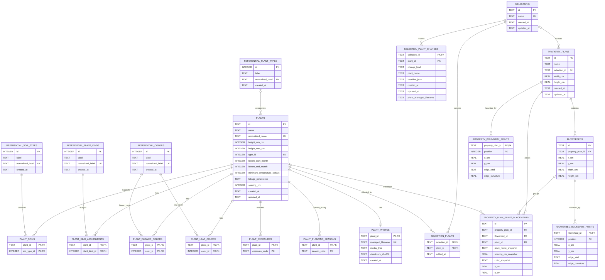

# Database schema

This diagram describes the final SQLite schema after applying every migration in
`packages/database/migrations` in numeric order (currently `001` through `005`).
It shows persisted columns and database-enforced relationships, rather than
application-level associations inferred from similarly named columns.

## Migration evolution notes

- `001_initial_schema.sql` creates the catalog, reference data, photos,
  selections, and their join tables.
- `002_remove_selection_normalized_name.sql` rebuilds `selections`, removes
  `normalized_name`, and makes the original `name` unique.
- `003_selection_plant_changes.sql` adds selection-specific modification and
  deletion snapshots. Its `plant_id` is part of the primary key but is
  intentionally not a foreign key, allowing a deleted catalog plant to remain
  represented in a selection.
- `004_deleted_plant_photo.sql` adds the optional managed-photo filename to
  those snapshots.
- `005_property_plans.sql` adds property plans, flowerbeds, placements, and
  ordered boundary points. A placement's `flowerbed_id` and `plant_id` are
  optional and become `NULL` if their referenced row is deleted.

The database does not enforce that a placement's optional flowerbed belongs to
the same property plan as the placement; repository code must preserve that
cross-table invariant.
