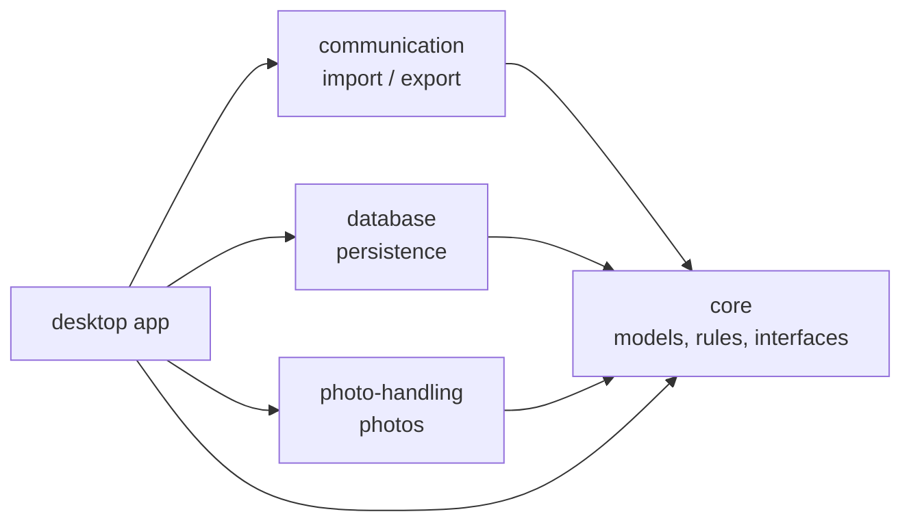
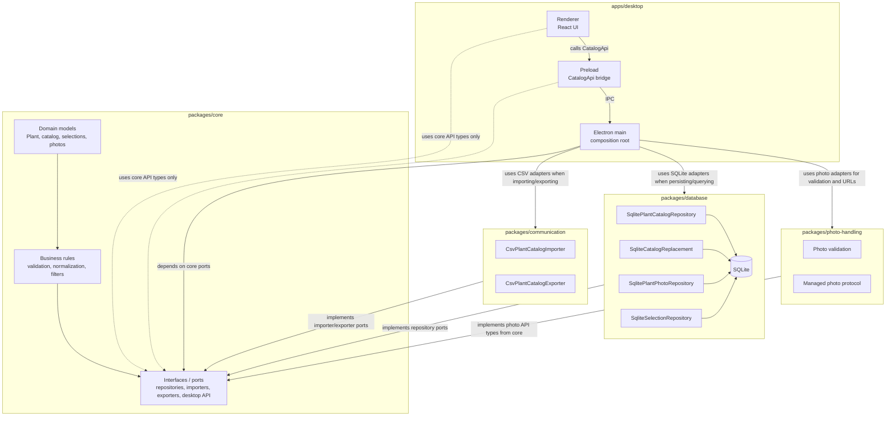

# Package structure

This project is a multi apps project. Goal is to share a core package with business rules to multiples apps all sharing at least the same technology.
Following this principle, there is:

- core package expected to contains domain models, business rules
- communication package expected to handle import and export of files, data
- database as we will use SQL langage, or a toolkit that encapsulate it
- apps folder that will contain
  - desktop app
  - mobile app
  - web app

## Simple package links

In short: every package follows `core`. Apps use `core` directly, then choose the implementation packages they need.

## Architecture overview

Dependency direction:

- `core` is the owner of domain models, rules, and interfaces. It must not depend on app, database, communication, or photo-handling packages.
- `database` implements repository interfaces from `core`.
- `communication` implements import/export interfaces from `core`.
- `photo-handling` implements photo-related data handling using types from `core`.
- `apps/desktop/src/renderer` and `apps/desktop/src/preload` use only the API contracts exposed by `core`.
- `apps/desktop/src/main` is the composition root. It is allowed to instantiate concrete adapters from `database`, `communication`, and `photo-handling` when needed.

## Core package

This is the more important package as it contains all domains and rules to make the apps work the same whatever the deployment.
When needed, it relies on interfaces to delegate implementation one level higher.

## Communication package

It handles all formats of import and export. It is separated from the core package as it will not be deployed in all apps.

## Database package

It contains all the implementation for the interfaces from Core that manipulate models.

## Apps package

This is the folder for all apps

### Desktop

This is the first implementation, it use core, communication and database package to provide a standalone offline experience.
Chosen implementation is Electron.

### Mobile

Will come later.

### Web

Will come later.
