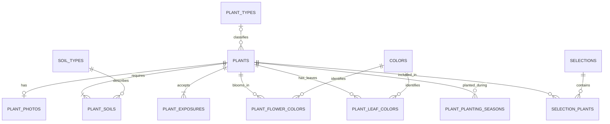

# MyLittleGarden — Data Structuration

## 1. Purpose and scope

This document defines the logical plant model and its SQLite representation for the desktop MVP. The same domain vocabulary and identifiers must be reused by the CSV importer, application services, and future server implementation.

Implementation artifacts:

- [Initial SQLite migration](../../packages/database/migrations/001_initial_schema.sql)
- [Framework-independent plant types](../../packages/core/src/plant.ts)
- [Shared constants](../../packages/core/src/constants.ts)
- [Shared normalization](../../packages/core/src/normalization.ts)
- [Plant input validation](../../packages/core/src/validation.ts)
- [Database acceptance tests](../../packages/database/tests/initial-schema.test.cjs)

The model is designed to:

- prevent duplicate plant names;
- store several thousand plants without an application-defined catalog limit;
- keep multi-valued attributes relational rather than storing comma-separated text;
- allow imported plant types, soil types, and colors to extend their vocabularies;
- keep exposures and planting seasons as closed application constants;
- write a plant and all its relationships atomically.

SQLite is the current physical target. Its technical and disk limits still apply; “unlimited” means that MyLittleGarden imposes no business or configuration limit on the number of plants.

## 2. Naming and common conventions

- Database identifiers use English `snake_case`.
- User-facing labels and CSV headings remain French.
- Plant and selection identifiers are UUID strings generated by the application.
- Dates are stored as UTC ISO-8601 text.
- Foreign-key enforcement must be enabled on **every** SQLite connection:

```sql
PRAGMA foreign_keys = ON;
```

- Schema changes are delivered through ordered, versioned migrations.
- Import and application writes use a transaction. No plant is committed without its mandatory relationships.

## 3. Name and vocabulary normalization

The application generates `normalized_name` and `normalized_label` using one shared, framework-independent function:

1. Trim surrounding whitespace.
2. Collapse consecutive internal whitespace to one space.
3. Apply Unicode NFKD normalization.
4. Remove Unicode combining marks (diacritics).
5. Convert to lowercase using the same locale-independent application rule.

Equivalent values therefore share the same key. For example, `Rose`, `rose`, `ROSE`, and `Rosé` normalize to `rose`.

The repository and CSV preview validator must call the same normalization function. SQLite then provides the final protection through unique indexes on the normalized columns. All database writes go through the repository so a display value and its normalized key cannot diverge.

## 4. Plant fields

The main entity is named `plants`, because the catalog can contain flowers, foliage plants, grasses, and other plant categories.

| French field         | Database representation                 |  SQLite type | Mandatory | Rules                                                                                                         |
| -------------------- | --------------------------------------- | -----------: | :-------: | ------------------------------------------------------------------------------------------------------------- |
| Nom                  | `plants.name`, `plants.normalized_name` |         TEXT |    Yes    | Non-empty; normalized name is unique                                                                          |
| Hauteur              | `height_min_cm`, `height_max_cm`        |      INTEGER |    No     | Minimum may be provided alone; values non-negative; when present, maximum is greater than or equal to minimum |
| Type                 | `type_id` → `plant_types`               |      INTEGER |    No     | Extensible vocabulary                                                                                         |
| Fleur/autre          | `plant_kind`                            |         TEXT |    No     | `flower`, `foliage`, `grass`, or `other`                                                                      |
| Sol                  | `plant_soils` → `soil_types`            | relationship |    Yes    | At least one soil; extensible vocabulary                                                                      |
| Exposition           | `plant_exposures.exposure_code`         | relationship |    Yes    | At least one closed exposure code                                                                             |
| Floraison            | `bloom_start_month`, `bloom_end_month`  |      INTEGER |    No     | Both absent or both present; inclusive month numbers from 1 through 12                                        |
| Couleurs fleurs      | `plant_flower_colors` → `colors`        | relationship |    No     | Zero or more colors                                                                                           |
| Couleurs feuilles    | `plant_leaf_colors` → `colors`          | relationship |    No     | Zero or more colors                                                                                           |
| Température min      | `minimum_temperature_celsius`           |      INTEGER |    No     | Celsius                                                                                                       |
| Feuillage persistant | `foliage_persistence`                   |         TEXT |    No     | `evergreen`, `semi_evergreen`, or `deciduous`                                                                 |
| Espace               | `spacing_cm`                            |      INTEGER |    No     | One non-negative value in centimeters                                                                         |
| Plantation           | `plant_planting_seasons.season_code`    | relationship |    No     | Zero or more closed season codes                                                                              |

A blooming interval is inclusive. When `bloom_end_month` is lower than `bloom_start_month`, the period crosses the end of the calendar year; for example, `11 → 2` means November through February.

## 5. SQLite schema

### 5.1 Extensible vocabularies

Plant types, soil types, and colors can be introduced by CSV imports. Unknown normalized values are created inside the same transaction as the catalog replacement. Equivalent labels reuse the existing row.

There is no `is_seeded` field: the MVP has no vocabulary-administration behavior and makes no persistence-level distinction between initial and imported values.

```sql
CREATE TABLE plant_types (
    id               INTEGER PRIMARY KEY,
    label            TEXT NOT NULL CHECK (length(trim(label)) > 0),
    normalized_label TEXT NOT NULL CHECK (length(normalized_label) > 0),
    created_at       TEXT NOT NULL,
    CONSTRAINT uq_plant_types_normalized_label UNIQUE (normalized_label)
);

CREATE TABLE soil_types (
    id               INTEGER PRIMARY KEY,
    label            TEXT NOT NULL CHECK (length(trim(label)) > 0),
    normalized_label TEXT NOT NULL CHECK (length(normalized_label) > 0),
    created_at       TEXT NOT NULL,
    CONSTRAINT uq_soil_types_normalized_label UNIQUE (normalized_label)
);

CREATE TABLE colors (
    id               INTEGER PRIMARY KEY,
    label            TEXT NOT NULL CHECK (length(trim(label)) > 0),
    normalized_label TEXT NOT NULL CHECK (length(normalized_label) > 0),
    created_at       TEXT NOT NULL,
    CONSTRAINT uq_colors_normalized_label UNIQUE (normalized_label)
);
```

New vocabulary values must be listed in the import preview before confirmation. Vocabulary rows are not automatically deleted during catalog replacement; retaining them provides stable identifiers and allows later imports to reuse them.

### 5.2 Plants

```sql
CREATE TABLE plants (
    id                       TEXT PRIMARY KEY,
    name                     TEXT NOT NULL CHECK (
        length(trim(name)) > 0 AND name = trim(name)
    ),
    normalized_name          TEXT NOT NULL CHECK (length(normalized_name) > 0),
    height_min_cm            INTEGER CHECK (height_min_cm >= 0),
    height_max_cm            INTEGER CHECK (height_max_cm >= 0),
    type_id                  INTEGER,
    plant_kind               TEXT CHECK (
        plant_kind IN ('flower', 'foliage', 'grass', 'other')
    ),
    bloom_start_month        INTEGER CHECK (
        bloom_start_month BETWEEN 1 AND 12
    ),
    bloom_end_month          INTEGER CHECK (
        bloom_end_month BETWEEN 1 AND 12
    ),
    minimum_temperature_celsius INTEGER,
    foliage_persistence      TEXT CHECK (
        foliage_persistence IN ('evergreen', 'semi_evergreen', 'deciduous')
    ),
    spacing_cm               INTEGER CHECK (spacing_cm >= 0),
    created_at               TEXT NOT NULL,
    updated_at               TEXT NOT NULL,

    CONSTRAINT uq_plants_normalized_name UNIQUE (normalized_name),
    CONSTRAINT ck_plants_height_range CHECK (
        height_max_cm IS NULL
        OR (height_min_cm IS NOT NULL AND height_max_cm >= height_min_cm)
    ),
    CONSTRAINT ck_plants_bloom_completeness CHECK (
        (bloom_start_month IS NULL AND bloom_end_month IS NULL)
        OR (bloom_start_month IS NOT NULL AND bloom_end_month IS NOT NULL)
    ),
    CONSTRAINT fk_plants_type FOREIGN KEY (type_id)
        REFERENCES plant_types (id)
        ON UPDATE RESTRICT
        ON DELETE RESTRICT
);

CREATE INDEX idx_plants_type_id ON plants (type_id);
CREATE INDEX idx_plants_bloom_period
    ON plants (bloom_start_month, bloom_end_month);
```

UUID syntax is validated by the domain service before persistence. The database primary key guarantees uniqueness.

### 5.3 Multi-valued extensible attributes

```sql
CREATE TABLE plant_soils (
    plant_id    TEXT NOT NULL,
    soil_type_id INTEGER NOT NULL,
    PRIMARY KEY (plant_id, soil_type_id),
    FOREIGN KEY (plant_id) REFERENCES plants (id) ON DELETE CASCADE,
    FOREIGN KEY (soil_type_id) REFERENCES soil_types (id)
        ON UPDATE RESTRICT ON DELETE RESTRICT
);

CREATE INDEX idx_plant_soils_soil_plant
    ON plant_soils (soil_type_id, plant_id);

CREATE TABLE plant_flower_colors (
    plant_id TEXT NOT NULL,
    color_id INTEGER NOT NULL,
    PRIMARY KEY (plant_id, color_id),
    FOREIGN KEY (plant_id) REFERENCES plants (id) ON DELETE CASCADE,
    FOREIGN KEY (color_id) REFERENCES colors (id)
        ON UPDATE RESTRICT ON DELETE RESTRICT
);

CREATE INDEX idx_plant_flower_colors_color_plant
    ON plant_flower_colors (color_id, plant_id);

CREATE TABLE plant_leaf_colors (
    plant_id TEXT NOT NULL,
    color_id INTEGER NOT NULL,
    PRIMARY KEY (plant_id, color_id),
    FOREIGN KEY (plant_id) REFERENCES plants (id) ON DELETE CASCADE,
    FOREIGN KEY (color_id) REFERENCES colors (id)
        ON UPDATE RESTRICT ON DELETE RESTRICT
);

CREATE INDEX idx_plant_leaf_colors_color_plant
    ON plant_leaf_colors (color_id, plant_id);
```

The composite primary keys prevent the same soil or color from being associated with one plant more than once.

### 5.4 Closed constants

Exposure and planting seasons are controlled by the application and cannot be extended by users or CSV imports. They use checked codes instead of editable lookup tables.

```sql
CREATE TABLE plant_exposures (
    plant_id     TEXT NOT NULL,
    exposure_code TEXT NOT NULL CHECK (
        exposure_code IN ('sun', 'partial_shade', 'shade')
    ),
    PRIMARY KEY (plant_id, exposure_code),
    FOREIGN KEY (plant_id) REFERENCES plants (id) ON DELETE CASCADE
);

CREATE INDEX idx_plant_exposures_code_plant
    ON plant_exposures (exposure_code, plant_id);

CREATE TABLE plant_planting_seasons (
    plant_id   TEXT NOT NULL,
    season_code TEXT NOT NULL CHECK (
        season_code IN ('spring', 'summer', 'autumn', 'winter')
    ),
    PRIMARY KEY (plant_id, season_code),
    FOREIGN KEY (plant_id) REFERENCES plants (id) ON DELETE CASCADE
);

CREATE INDEX idx_plant_planting_seasons_code_plant
    ON plant_planting_seasons (season_code, plant_id);
```

Matching TypeScript union types are the application source of truth:

```ts
export type ExposureCode = 'sun' | 'partial_shade' | 'shade';

export type PlantingSeasonCode = 'spring' | 'summer' | 'autumn' | 'winter';
```

Changing either set requires an intentional application update and database migration.

### 5.5 Managed photo metadata

Each plant can have at most one managed photo in the MVP. The binary image remains in application-managed storage; the database stores its metadata.
Only the generated technical filename is retained. Supported media types are
validated by the application so adding a format does not require a schema migration.

```sql
CREATE TABLE plant_photos (
    plant_id         TEXT PRIMARY KEY,
    managed_filename TEXT NOT NULL UNIQUE,
    media_type       TEXT NOT NULL,
    checksum_sha256  TEXT NOT NULL,
    created_at       TEXT NOT NULL,
    FOREIGN KEY (plant_id) REFERENCES plants (id) ON DELETE CASCADE
);
```

### 5.6 Saved selections

```sql
CREATE TABLE selections (
    id              TEXT PRIMARY KEY,
    name            TEXT NOT NULL CHECK (
        length(trim(name)) > 0 AND name = trim(name)
    ),
    normalized_name TEXT NOT NULL CHECK (length(normalized_name) > 0),
    created_at      TEXT NOT NULL,
    updated_at      TEXT NOT NULL,
    CONSTRAINT uq_selections_normalized_name UNIQUE (normalized_name)
);

CREATE TABLE selection_plants (
    selection_id TEXT NOT NULL,
    plant_id     TEXT NOT NULL,
    added_at     TEXT NOT NULL,
    PRIMARY KEY (selection_id, plant_id),
    FOREIGN KEY (selection_id) REFERENCES selections (id) ON DELETE CASCADE,
    FOREIGN KEY (plant_id) REFERENCES plants (id) ON DELETE CASCADE
);

CREATE INDEX idx_selection_plants_plant_selection
    ON selection_plants (plant_id, selection_id);
```

## 6. Relationships



The diagram shows the domain requirement of at least one soil and exposure. SQLite cannot defer a cross-table “at least one child” constraint until transaction commit, so the application service enforces this invariant before committing the plant graph.

## 7. Domain contract

The framework-independent core exposes complete plant records rather than database rows:

```ts
export type PlantKind = 'flower' | 'foliage' | 'grass' | 'other';

export type FoliagePersistence = 'evergreen' | 'semi_evergreen' | 'deciduous';

export interface VocabularyValue {
  id: number;
  label: string;
}

export interface PlantPhoto {
  managedFilename: string;
  mediaType: 'image/jpeg' | 'image/png' | 'image/webp';
  checksumSha256: string;
}

export interface Plant {
  id: string;
  name: string;
  heightCm: { min: number; max: number | null } | null;
  type: VocabularyValue | null;
  kind: PlantKind | null;
  soils: [VocabularyValue, ...VocabularyValue[]];
  exposures: [ExposureCode, ...ExposureCode[]];
  bloom: { startMonth: number; endMonth: number } | null;
  flowerColors: VocabularyValue[];
  leafColors: VocabularyValue[];
  minimumTemperatureCelsius: number | null;
  foliagePersistence: FoliagePersistence | null;
  spacingCm: number | null;
  plantingSeasons: PlantingSeasonCode[];
  photo: PlantPhoto | null;
  createdAt: Date;
  updatedAt: Date;
}
```

The plant write service must:

1. Normalize and validate the plant name.
2. Validate the UUID, scalar ranges, enums, and closed constants.
3. Require at least one normalized soil and one exposure.
4. Resolve or create extensible vocabulary rows.
5. Insert or update the plant and replace its relationship rows in one transaction.
6. Roll back the complete transaction if any operation fails.

## 8. Import rules

- CSV multi-value cells are parsed before persistence; list separators never enter relational columns.
- Duplicate normalized plant names within the uploaded file are blocking errors.
- Names conflicting with another database plant ID are blocking errors.
- Unknown exposure and planting-season values are blocking errors.
- Unknown type, soil, and color values are displayed in the preview and created only after confirmation.
- Missing name, soil, or exposure values are blocking errors. Bloom may be absent; when supplied, both months are required.
- All catalog, vocabulary, relationship, selection-impact, and photo-metadata changes occur in one transaction.
- A failed import leaves the previous database state unchanged.

## 9. Acceptance criteria and validation

| Criterion                         | Design proof                                                                              | Validation scenario                                                                                                |
| --------------------------------- | ----------------------------------------------------------------------------------------- | ------------------------------------------------------------------------------------------------------------------ |
| No duplicate plant names          | Unique `plants.normalized_name` plus shared application normalization                     | Attempt exact, case-varied, whitespace-varied, and accent-varied duplicates; preview and database must reject them |
| No application entry limit        | UUID identifiers, paginated reads, indexed filters, and no configured maximum             | Import and paginate at least 50,000 valid plants                                                                   |
| Full field list represented       | Every requested field maps to a scalar column or normalized relationship                  | Persist and reload a plant containing every optional and mandatory attribute                                       |
| Mandatory information enforced    | Service requires name, soil, and exposure; bloom is either absent or contains both months | Reject each missing mandatory value independently and verify rollback                                              |
| Multi-valued attributes supported | Junction tables with composite primary keys                                               | Store several soils, exposures, colors, and seasons; reject duplicate associations                                 |
| Closed constants protected        | SQLite `CHECK` constraints and TypeScript unions                                          | Reject unsupported exposure and planting-season codes                                                              |
| Extensible values supported       | Unique normalized lookup tables                                                           | Import a new type, soil, and color; verify reuse by normalized variants                                            |
| Measurement integrity             | Range and non-negative `CHECK` constraints                                                | Reject negative height/spacing and an inverted height range                                                        |
| Relationship integrity            | Foreign keys, cascades, and restricted vocabulary deletion                                | Reject orphan associations; verify plant deletion removes dependent rows                                           |
| Atomic import                     | Single write transaction                                                                  | Force a failure after staging relationships and verify that no partial data remains                                |

## 10. Deferred decisions

- Vocabulary editing and removal UI.
- Botanical synonyms distinct from the unique display name.
- Multiple photos per plant.
- Free-text planting methods or instructions.
- PostgreSQL migration and mobile synchronization.
- Database-level deferred enforcement of mandatory child relationships; the MVP enforces these in its transaction service.

## 11. Verification command

Run the database acceptance suite from the repository root:

```bash
npm test
```
